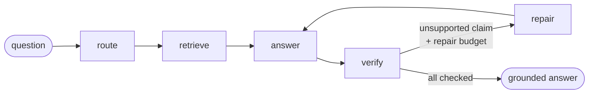

# Provenance

**Ask a textbook a question. Get an answer where every claim is checked against the exact page image that proves it — and shown to you.**

Provenance is a citation-grounded RAG system over the OpenStax *Anatomy & Physiology 2e* textbook (1,347 pages). It retrieves the pages most likely to answer your question, drafts an answer, then **verifies each individual claim against the page it cites** and repairs the ones it can't support. The page images are rendered right next to the answer, so the grounding is auditable by eye, not taken on faith.

There is **no GPU anywhere** in this project. Retrieval is Cohere Embed v4 (multimodal embeddings over page *images*), and answering + verification are Claude vision calls. Everything is API-based and runs on serverless functions.

> **Live demo:** _populated after the Vercel deploy._

---

## How it works

The agentic core is a [LangGraph](https://langchain-ai.github.io/langgraph/) state machine. Every node depends only on a small protocol (`Router`, `Retriever`, `Answerer`, `Judge`), so the *same graph* runs on offline fakes (for tests/CI) and on the real Cohere + Claude backends (in production).



1. **retrieve** — embed the question with Cohere Embed v4 and rank all 1,347 page-image vectors by dot product (vectors are L2-normalized, so this is cosine similarity). Top-*k* pages are returned.
2. **answer** — Claude is shown the *images* of the retrieved pages and drafts an answer as a set of discrete **claims**, each citing the page id(s) it came from.
3. **verify** — for each claim, Claude (acting as a fact-checker) is shown only the cited page image(s) and returns a verdict (`supported` / `unsupported`) plus the supporting span.
4. **repair** — if any claim is unsupported and repair budget remains, the rejected claims are fed back and the answer is redrafted. (Default: one repair pass.)

**Confidence** is simply the fraction of claims the judge upheld. The UI shows the verdict on every claim and the cited page beside it, so a low-confidence answer is visibly low-confidence.

---

## Repository layout

```
src/provenance/
  models.py            # Pydantic types: PageRef, Claim, VerifiedClaim, GroundedAnswer
  config.py            # pydantic-settings, env_prefix="PROVENANCE_"
  protocols.py         # Router / Retriever / Answerer / Judge seams
  graph.py             # the LangGraph state machine (route→retrieve→answer→verify→repair)
  pipeline.py          # Pipeline.run(query) -> GroundedAnswer
  tracing.py           # lightweight span timings
  demo.py              # fakes wired into a pipeline (no keys)
  deploy.py            # real Cohere + Claude pipeline (loads the bundled index)
  api/app.py           # FastAPI factory: GET /health, POST /query
  backends/
    embedding_retriever.py  # Cohere Embed v4 retrieval over the page index
    vlm.py                  # Claude vision answerer + judge (HostedVLM)
    page_index.py           # the saved vector index + manifest
    fakes.py                # scripted Router/Retriever/VLM for offline runs
  eval/                # golden-set loader, metrics, runner, CI gate

scripts/
  build_index.py       # render → embed → save index → upload pages to Hugging Face
  run_eval.py          # offline plumbing gate (CI) and --real quality eval
  serve_demo.py        # local fake API with CORS, for frontend dev

web/                   # Next.js 15 (App Router) frontend
api/index.py           # Vercel Python entrypoint (wraps the real pipeline)
data/golden/           # the hand-verified golden question set
data/corpus/           # index.npy + manifest.json are committed; page images are not
```

---

## Local development

### Demo mode (no API keys)

Exercises the entire UI and the verify→repair loop end to end using scripted fakes. The cited-page thumbnails won't load (the fakes return placeholder URLs), but routing, answering, verification, confidence, and repairs all work.

```bash
# backend — fake pipeline behind the real HTTP surface, with CORS
uv venv && uv pip install -e ".[dev]"
python scripts/serve_demo.py            # http://127.0.0.1:8000

# frontend (separate shell)
cd web && npm install && npm run dev    # http://localhost:3000
```

### Real mode (needs keys + a built corpus)

```bash
export PROVENANCE_COHERE_API_KEY=...      # Cohere (retrieval)
export ANTHROPIC_API_KEY=...              # Claude (answer + verify)
export PROVENANCE_PAGES_BASE_URL=https://huggingface.co/datasets/<you>/provenance-corpus/resolve/main/pages

python scripts/run_eval.py --real --corpus data/corpus   # honest quality numbers
```

---

## Building the corpus

The 455 MB source PDF and the rendered page images are **never committed**. `build_index.py` renders every page, embeds it with Cohere, saves the bundled index (`data/corpus/index.npy` + `manifest.json`, which *are* committed), and uploads the page images to a public Hugging Face dataset so the resolve URLs load without auth.

```bash
# needs poppler (pdf2image), PROVENANCE_COHERE_API_KEY, and `hf auth login`
uv pip install -e ".[build]"
python scripts/build_index.py \
    --pdf anatomy.pdf \
    --doc-id anatomy-physiology-2e \
    --corpus data/corpus \
    --hf-repo <you>/provenance-corpus
```

Then make the Hugging Face dataset **public** so the page images load in the browser. Cost is ~$0.30 in Cohere embeddings; runtime ~20–40 min.

---

## Evaluation

Provenance reports metrics honestly. There are two distinct evals.

### Offline plumbing gate (runs in CI, no keys)

Over the 11-question golden set with the scripted fakes, the gate asserts the *machinery* is sound — not answer quality:

| metric | value | what it means |
| --- | --- | --- |
| faithfulness | **1.000** | no claim survives verification unless the judge supports it |
| well-formed | **1.000** | every citation points to a page that was actually retrieved |

Retrieval and citation-overlap metrics are `0.000` here **by design** — the fakes don't read the real corpus, so the gate deliberately checks only the verify/repair plumbing and citation hygiene. This is what `python scripts/run_eval.py` (no args) enforces in CI.

### Real retrieval + grounding quality (local, needs keys)

`python scripts/run_eval.py --real --corpus data/corpus` runs the full pipeline against the real page-image index over the same golden questions and reports:

| metric | value |
| --- | --- |
| faithfulness (mean confidence) | _pending corpus build_ |
| citation precision / recall / F1 | _pending corpus build_ |
| recall@5 | _pending corpus build_ |
| nDCG@5 | _pending corpus build_ |
| well-formed | _pending corpus build_ |

_These numbers are filled in from a real run once the corpus is built — they are reported as measured, not aspirational._

---

## Deployment (Vercel)

Two Vercel projects from this one repo:

- **API** — root `vercel.json` points the Python runtime at `api/index.py`, which wraps the real pipeline. The committed `data/corpus/{index.npy,manifest.json}` are bundled into the function via `includeFiles`; page *images* are served from Hugging Face, not the function. `maxDuration` is 300s to cover the verify→repair round-trips.
- **WEB** — the `web/` Next.js app. Set `NEXT_PUBLIC_API_URL` to the deployed API URL.

Environment variables (API project): `PROVENANCE_COHERE_API_KEY`, `ANTHROPIC_API_KEY`, `PROVENANCE_PAGES_BASE_URL`. See [`.env.example`](.env.example).

---

## Corpus & license

- **Corpus:** OpenStax *Anatomy & Physiology 2e*, © Rice University, licensed **[CC BY 4.0](https://creativecommons.org/licenses/by/4.0/)**. Page numbers throughout are PDF page indices. Download: <https://openstax.org/details/books/anatomy-and-physiology-2e>.
- **Code:** MIT.

A builder-track demo — the interesting part is the verify→repair loop and that the evidence is shown, not asserted.
